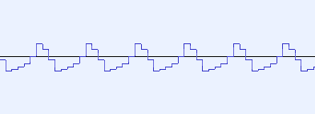

# Dischord MML 文法

Dischord MML は，音楽の上に発生するイベント(例: ある音階の音が鳴る，音の大きさが変わる)を時系列順に並べたもの，すなわち文字で表現された楽譜です．

例えば，以下のイベントが順番に起こるとします．

1. 4分音符の長さでド(C)が鳴る

2. 8分音符の長さでレ(D)が鳴る

3. 4分音符の長さでミ(E)が鳴る

そのような音楽は， MML で以下のように表せられます．

```
C4D8E4
```

## 注意事項

- 大文字と小文字は区別されません．

- ASCII でない文字を含む事は出来ません．

- 空白や改行は通常無視されますが，数値が空白や改行で区切られている場合，それぞれ独立した数値として扱われます．

## イベント

それぞれのイベントは，そのイベントが何であるかを表す1文字以上の大文字アルファベット及び記号と，`,`で区切られた0個以上のパラメータで構成されます．

ここでは，イベントの後に続くパラメータのプレースホルダーは小文字のアルファベットで表されます．

### 音符

```
Csn Dsn Esn Fsn Gsn Asn Bsn
```

上記の空白で区切られたイベントは，それぞれドレミファソラシに対応しています．

`s`には0個以上の臨時記号が入ります．`+`,`#`はシャープ，`-`はフラットを表現します．

`n`はn分音符を表します．付点は`.`，タイは`&`でそれぞれ表現されます．

`n`が省略された場合はデフォルトの値(初期値: 8)が適用されます．

(以降マニュアル内で"`n`分"という表現が出てきた際には，以上の2行が暗黙に付記されているものとします．)

#### 使用例

- 4分音符と付点8分音符がタイで繋がれた長さのファ

    ```
    F4&8.
    ```

### 休符

```
Rn
```

`n`分休符を表現します．

#### 使用例

- それぞれの間に8分休符が挟まれた，4分音符のドレミ

   ```
   C4R8D4R8E4
   ```

### オクターブの変更

```
< >
```
オクターブを上げ(下げ)ます。

なお，1オクターブ中最も低い音は`C`，最も高い音は`B`とします．

#### 使用例

- ドミソをあるオクターブとその1オクターブ上で順番に鳴らす

   ```
   CEG<CEG
   ```

### 和音

```
(...)n
```

括弧に囲まれた音を`n`分音符の和音と見なします．

括弧内に書くことが出来るのは，音階と臨時記号，そしてオクターブの変更(`<>`)です．

ただし，括弧内で変更されたオクターブは括弧外に影響しません．

#### 使用例

- F#m(ファ#, ラ, オクターブ上のド#で構成されるコード)を8分音符，同一オクターブで4回鳴らしたもの

    ```
    (F+A<C+)8(F+A<C+)8(F+A<C+)8(F+A<C+)8
    ```

### テンポ

```
Tn
```

テンポを`n`(4分音符が60秒間に`n`回鳴らされる速さ)に設定します．デフォルト値は120です．

#### 使用例

- テンポを140に設定

    ```
    T140
    ```

### 音量

```
Vn
@Vn
```

音量をデフォルトの`n`%に設定します．

#### 二つのコマンドの差異

`@V`は後述の**合成**の際に一つの波形に影響するのに対し，`V`は合成されたすべての波形に同時に作用します．

#### 使用例

- 音量を80%に設定

    ```
    V80
    ```

    または

    ```
    @V80
    ```

### デフォルト音長

```
Ln
```

音符，休符，和音に音長が指定されなかったときのデフォルト値を`n`分に設定します．

#### 使用例

- 16分音符でドミソミドと順番に鳴らすもの

    ```
    L16CEGEC
    ```

### オシレーターの変更

```
@n
```

オシレーター(音色)を変更します．`n`と音色の対応は次の通りです．

|`n`|波形          |
|--:|:-------------|
|  0|矩形波(1/2)   |
|  1|矩形波(1/4)   |
|  2|矩形波(1/8)   |
|  3|三角波        |
|  4|ノコギリ波    |
|  5|サイン波      |
|  6|ホワイトノイズ|

#### 使用例

- オシレーターのノコギリ波への変更

    ```
    @4
    ```

### ADSR エンベロープ

```
@Ea,d,s,r
```

10`a`ミリ秒のアタック，10`d`ミリ秒のディケイ，`s`%のサステイン，10`r`ミリ秒のリリースを持つエンベロープを音量に適用します．

#### 使用例

- 0.05秒のアタック，0.1秒のディケイ，50%のサステイン，0.3秒のリリースを持つ音量のエンベロープ

    ```
    @E5,10,50,30
    ```

### ユニゾン

```
@Dn,d
```

`n`個の音を，1個ごとに+`d`‱(+`d` bps, +`d`/100%)のデチューンを掛けて重ねます．

#### 使用例

- それぞれ+0%,+0.01%,+0.02%のデチューンが掛かった3つの音を重ねて出力する

    ```
    @D3,1
    ```

### 波形を登録する

- 4bit PCM

    ```
    @H{16進文字列}
    ```

16進文字列を 4bit PCM として登録します．登録された波形はオシレーターとして用いることが出来ます．

それぞれの波形には， MML 上に登場した順に0から番号をつけられます．

#### 使用例

```
@H{01248FC6}
```

例えば上記のPCMは以下の波形に対応しています．



### オシレーターを登録された波形に変更

```
@Pn
```

`n` 番目の波形をオシレーターとして使用します．

#### 使用例

- 矩形波を登録した後，オシレーターを登録した矩形波に設定

    ```
    @H{0F}@P0
    ```

### 音符の末尾の無音時間の設定

```
@Gn
```

それぞれの音符の末尾には，音符を区切るための無音時間があります．その無音時間を`n`ミリ秒に設定します．デフォルト値は1ミリ秒です．

#### 使用例

- 無音時間を0.02秒に設定

    ```
    @G20
    ```

### チューニングの変更

```
@Tn
```

音の高さを，周波数基準で`n`‰(`n`/10%)に変更します．デフォルトは1000‰であり，A4 の周波数は 440Hz です．

#### 使用例

- A4の周波数を約435Hzに変更します(98.863...% ≒ 98.9%)

    ```
    @T989
    ```

### エフェクトの適用

```
@Fxn,...
```

`x`にはエフェクトの種類が入り，その後ろに，その数がエフェクターの種類に依存するパラメータが続きます．

- ディレイ

    ```
    @FDd,f
    ```

    `d`ミリ秒，`f`‰(`f`/10%)のフィードバックを持つディレイを適用します．

#### 使用例

- 20%のフィードバックを持つ，0.15秒のディレイを適用したドレミ

    ```
    @FD150,200CDE
    ```

### 合成

```
@(@..., @..., ...)
```

`@`で始まるコマンドをカンマで区切って列挙することで，複数の波形にそれぞれ効果を加えた上で，同時に発音させる事ができます．

#### 使用例

- 音量80%のサイン波，音量10%の1オクターブ上のノコギリ波を同時に発音

    ```
    t120@(@5@v80,@4@t2000@v10)@e0,30,20,20@d2,10l4<<ccggaagrffeeddc
    ```

## 構文

イベントとは別に，各種イベントを制御するための構文が存在します．

### 繰り返し

```
[...]n
```

`[]`で囲まれた範囲のイベントを`n`回繰り返します．

#### 使用例

- 4分音符でドレミと鳴らした後，8分音符でドレミと鳴らすのを3回繰り返す

    ```
    [L4CDEL8CDE]3
    ```

### トラック区切り

```
;
```

`;`で区切ることで，複数のMMLを同時に再生することが出来ます．

イベントによって与えられた変更もほとんどがリセットされますが，以下の例外があります．

- テンポ(`Tn`)

- 登録された波形(`@H{...}`)

#### 使用例

- ドソミソと8分音符で繰り返し鳴らしながら，オクターブ上でドミソミドと2分音符で鳴らす

    ```
    T150L8[CGEG]6;L2<CEGEC
    ```
